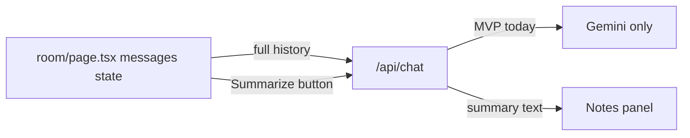

# MVP Today — Step-by-Step Prompt Playbook

You already have most of the app. Do **not** rebuild from scratch. Work in **Cursor Agent mode**, one step at a time. After each step: test locally, then paste the next prompt.

**Where this file lives:** `plans/mvp_prompt_playbook.md` (visible in the project sidebar)

**How to use this guide**

1. Switch Cursor to **Agent** mode (not Ask).
2. Copy the prompt for the current step only.
3. Paste it into chat and let the AI finish.
4. Run the **Success check**.
5. Only then go to the next step.

**Prerequisites (do once before Step 1)**

- `.env.local` has a real `GEMINI_API_KEY` (not `paste_your_key_here`)
- Terminal: `npm install` then `npm run dev`
- Open [http://localhost:3000](http://localhost:3000) and confirm the meeting room loads

---

## What’s already done (don’t rebuild)


| Requirement                 | Status  | Where                                                  |
| --------------------------- | ------- | ------------------------------------------------------ |
| Landing + room              | Done    | `app/page.tsx` → `/room`                               |
| Chat history in React state | Done    | `messages` in `app/room/page.tsx`                      |
| Full history sent to API    | Done    | `fetch("/api/chat", … messages: nextMessages…)`        |
| Gemini API connected        | Done    | `app/api/chat/route.ts`                                |
| All UI models → Gemini      | Done    | `app/api/chat/route.ts` (GPT/Claude fall back to Gemini) |
| Notes UI exists             | Partial | Heuristic regex summary only — not real AI summary yet |




---

## Step 1 — Force every model through Gemini ✅ DONE

Already implemented: non-Google UI models route through Gemini (`gemini-flash-latest` fallback).

### Success check (optional re-test)

1. Set an expert model to **GPT-4o** or **Claude**.
2. Send a chat message.
3. You get a reply (no “Missing OPENAI_API_KEY” / Anthropic error).

---

## Step 2 — Verify conversation history continuity ✅ DONE

Verified: `app/room/page.tsx` sends the full `messages` array (`role` + `content` + `agentName`) every call; API maps prior turns into Gemini history.

### Success check (optional re-test)

1. Message 1: “My product is called NovaNotes.”
2. Message 2: “What is my product called?”
3. Reply should say **NovaNotes**.

---

## Step 3 — Add end-of-chat AI summary ✅ DONE

**Goal:** A **Summarize meeting** button that sends the conversation to Gemini and shows decisions/key points in the Notes panel.

**Implemented:** Notes panel button → `/api/chat` with `mode: "summary"` → fills Goal / Decisions / Open questions / Running summary.

**Defaults locked for today**

- Add a button in the Notes panel (and/or header near “Take AI notes”).
- Reuse `/api/chat` with `mode: "summary"` (or a dedicated summary system prompt) — no new API file unless needed.
- Write result into `memory.summary` (and fill decisions/open questions if the model returns structured text).
- Show a loading state; disable when fewer than 2 real messages.

**File focus:** `app/api/chat/route.ts`, `app/room/page.tsx`

### Copy-paste prompt

```
Act as a Senior Full-Stack Developer. Implement a lightweight end-of-chat summary feature for today's MVP.

Files you may change:
- app/api/chat/route.ts
- app/room/page.tsx
- lib/types.ts only if needed

Requirements:
1. Add a clear "Summarize meeting" button in the Notes panel UI.
2. On click, send the current conversation history to /api/chat so Gemini produces a concise summary of:
   - Goal
   - Key decisions
   - Open questions
   - Next steps
3. Prefer extending the existing chat route with mode: "summary" (or equivalent) rather than creating a new route.
4. For summary mode, use a fixed summarizer system prompt (not a single expert persona). Still route through Gemini only.
5. Parse or place the AI output into the existing MeetingMemory fields shown in the Notes panel (at least memory.summary; update goal/decisions/openQuestions if easy).
6. Show loading + error states. Disable the button when there is not enough conversation to summarize.
7. Keep mobile layout usable — button should be tappable on a phone-sized screen.
8. Do not rebuild the whole page. Minimal, focused changes only.

After you're done, tell me exactly where the button is and how to test it.
```

### Success check

1. Have a short 3–4 message chat with decisions.
2. Open **Notes** → click **Summarize meeting**.
3. Notes panel shows a real AI summary (not just “You: … → …” beat lines).

---

## Step 4 — Mobile-friendly layout pass

**Goal:** Usable on your phone after Vercel deploy (chat, send, notes, summarize).

**File focus:** `app/globals.css`, light tweaks in `app/room/page.tsx` / `app/page.tsx` if needed

### Copy-paste prompt

```
Act as a Senior Frontend Developer. Do a mobile MVP polish pass only — no redesign.

Files: app/globals.css and app/room/page.tsx / app/page.tsx if needed.

Requirements for phone-width (~390px):
1. Meeting room must be usable: see chat, type a message, send, open Notes, use Summarize meeting.
2. Fix overflow/horizontal scroll, tiny tap targets, panels that cover the composer, or controls that fall off-screen.
3. Keep the existing visual language — do not invent a new design system.
4. Prefer CSS media-query fixes over large JSX rewrites.
5. Test mentally for iPhone-sized viewport; ensure bottom composer stays reachable.

When finished, list the mobile issues you fixed.
```

### Success check

1. Chrome DevTools → phone size (iPhone).
2. Send a message + open Notes + Summarize without horizontal scroll or blocked buttons.

---

## Step 5 — Production build check

**Goal:** Catch Vercel build failures before deploy.

### Copy-paste prompt

```
Act as a Senior Full-Stack Developer. Prepare this Next.js app for Vercel deploy.

Tasks:
1. Run npm run build and fix any TypeScript/build errors that appear.
2. Confirm GEMINI_API_KEY is read from process.env (not hardcoded).
3. Update .env.local.example to show GEMINI_API_KEY is required for MVP; keep OpenAI/Anthropic notes as optional/future.
4. Do not commit secrets. Do not edit .env.local contents in git.
5. Briefly tell me the exact commands I should run next for GitHub + Vercel.

Keep changes minimal — only what is needed to build cleanly.
```

### Success check

- `npm run build` completes with exit code 0.

---

## Step 6 — Push to GitHub + deploy on Vercel (you do this)

The AI can help with git/commands if you ask, but **you** create the GitHub repo and Vercel project.

### Copy-paste prompt (optional helper)

```
Help me push this project to GitHub and deploy on Vercel as a vibe coder.

Constraints:
- Do not commit .env.local or any API keys.
- Give me exact commands / clicks for Windows.
- Assume I may need to create a new GitHub repo and a new Vercel project.
- Remind me to add GEMINI_API_KEY in Vercel Project Settings → Environment Variables (Production + Preview), then redeploy.
```

### Your manual checklist

1. Create empty GitHub repo → push code (no secrets).
2. Import repo in [vercel.com](https://vercel.com) → Framework: Next.js.
3. Add env var: `GEMINI_API_KEY` = your key.
4. Deploy → open the URL on your phone.
5. Test: chat continuity + GPT/Claude model pick still replies + Summarize meeting.

---

## If something breaks — emergency prompt

```
Something broke after the last change. Do not add new features.

1. Explain the error in plain English.
2. Fix only the broken part with the smallest possible change.
3. Tell me exactly how to re-test.

Error / what I see:
[PASTE THE ERROR OR SCREENSHOT DESCRIPTION HERE]
```

---

## Suggested order for today

1. Step 1 (Gemini force) — ✅ done
2. Step 2 (history verify) — ✅ done
3. Step 3 (summary button) — ✅ done
4. Step 4 (mobile) — next
5. Step 5 (build)
6. Step 6 (GitHub + Vercel + phone test)
